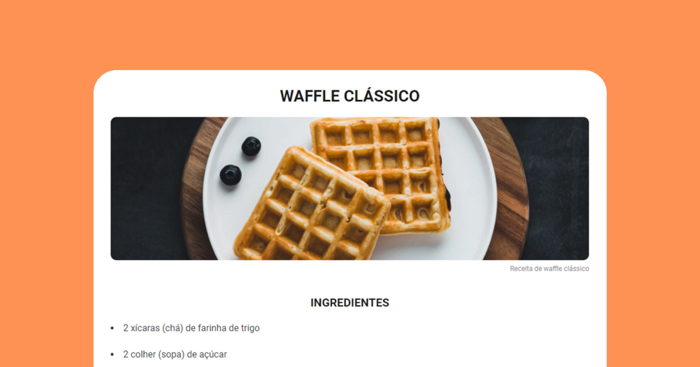

<h1 align="center"> Desafio piloto: Página de Receita </h1>

  <a href="#-tecnologias">Tecnologias</a>&nbsp;&nbsp;&nbsp;|&nbsp;&nbsp;&nbsp;
  <a href="#-projeto">Projeto</a>&nbsp;&nbsp;&nbsp;|&nbsp;&nbsp;&nbsp;
  <a href="#-layout">Layout</a>&nbsp;&nbsp;&nbsp;|&nbsp;&nbsp;&nbsp;
  <a href="#memo-licença">Licença</a>

  

 

  

## 🚀 Tecnologias

Esse projeto foi desenvolvido com as seguintes tecnologias:

- HTML e CSS
- Git e Github

## 💻 Projeto

Página web estilizada de uma receita real, com imagem, lista de ingredientes e modo de preparo.

## 🔖 Layout

Você pode visualizar a fonte da receita original através [DESSE LINK](https://www.tudogostoso.com.br/receita/961-feijao-tropeiro.html).

## :memo: Licença

Esse projeto está sob a licença MIT.

---

Feito com ♥ por eu mesmo graças à Rocketseat  :wave: [Participe da comunidade!](https://discord.gg/rocketseat)